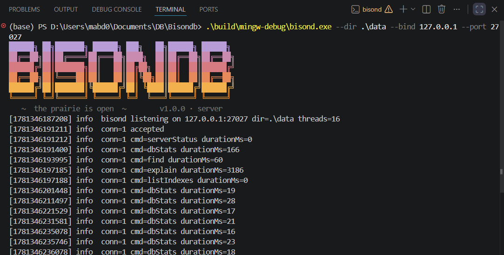

<div align="center">
  
  <h1>BisonDB</h1>
  <p><strong>A document database built from scratch — BSON storage, hand-written B+Trees, and a Compass-style GUI.</strong></p>
  <p>
    <a href="https://github.com/Abdullah-Masood-05/Bisondb/actions/workflows/ci.yml"></a>
    <a href="https://github.com/Abdullah-Masood-05/Bisondb/releases/latest"></a>
    <a href="https://github.com/Abdullah-Masood-05/Bisondb/commits"></a>
    <a href="https://github.com/Abdullah-Masood-05/Bisondb/stargazers"></a>
    <a href="LICENSE"></a>
    
    
    
  </p>
  <p>
    <a href="https://abdullah-masood-05.github.io/bisondb-site/">Documentation</a> ·
    <a href="https://github.com/Abdullah-Masood-05/Prairie">Prairie GUI</a>
  </p>
</div>

BisonDB is a document database with a BSON storage engine, inspired by MongoDB. It is written
in C++20 and targets Windows as its primary development platform, with Linux support via CI.
`bisondb_core` provides a BSON value model, a hardened BSON decoder/encoder, MongoDB Extended
JSON v2 reading/writing, an append-only collection store, a hand-written on-disk B+Tree
(no `std::map`, no third-party storage libraries), a query engine with index-aware planning,
and a hand-written portable socket layer (Winsock2/POSIX, no Asio). `bisond` is the network
daemon speaking a framed-BSON protocol ([docs/protocol.md](docs/protocol.md)), with a client
library and remote mode in the `bisonc` CLI.

## Building

### Prerequisites

- CMake 3.21+
- Ninja (recommended) or Visual Studio 2022
- MSVC, GCC, or Clang with C++20 support

### Quick start (MSVC / Visual Studio)

```bat
cmake --preset msvc
cmake --build --preset msvc-debug
ctest --preset msvc-debug
```

### Quick start (Ninja)

```bat
cmake --preset debug
cmake --build --preset debug
ctest --preset debug
```

### MinGW (MSYS2 GCC)

```bat
cmake --preset mingw-debug
cmake --build --preset mingw-debug
ctest --preset mingw-debug
```

## bisonc CLI

`bisonc` converts between BSON files (single documents or concatenated dumps, as produced by
mongodump) and JSON.

```bat
:: BSON -> JSON Lines (relaxed Extended JSON) on stdout
bisonc to-json dump.bson

:: Canonical (lossless) Extended JSON, written to a file
bisonc to-json dump.bson --canonical -o dump.jsonl

:: Pretty-printed instead of one document per line
bisonc to-json dump.bson --pretty

:: JSON (single document or JSON Lines) -> concatenated BSON
bisonc to-bson dump.jsonl -o dump.bson

:: Document count, total bytes, and per-type value counts
bisonc inspect dump.bson
```

Errors go to stderr with a non-zero exit code. Canonical mode round-trips losslessly:
`to-json --canonical` followed by `to-bson` reproduces the original file byte for byte.

### Database commands

```bat
bisonc db import       data\db zips tests\fixtures\zips.bson
bisonc db find         data\db zips "{\"pop\": {\"$gte\": 40000}}" --limit 5
bisonc db find         data\db zips "{\"pop\": {\"$gte\": 40000}}" --explain
bisonc db create-index data\db zips pop
bisonc db delete-many  data\db zips "{\"state\": \"AK\"}"
bisonc db indexes      data\db zips
bisonc db drop-index   data\db zips pop
```

`--explain` prints the chosen plan. The same range query before and after `create-index`:

```json
{ "plan": "scan",        "docsExamined": 29470, "docsReturned": 1015 }
{ "plan": "index_range", "index": "pop", "docsExamined": 1015, "docsReturned": 1015 }
```

Filters support `{field: literal}`, `$eq/$ne/$gt/$gte/$lt/$lte/$in`, `$and`/`$or`, and dotted
paths. The planner uses an index for a single equality or range on an indexed field (and `_id`
point lookups); everything else falls back to a full scan. Indexed plans always re-check the
complete filter on each fetched document.

## bisond server quickstart

> **bisond has NO authentication and NO TLS.** It binds to `127.0.0.1` by default;
> binding to any other address exposes the full database to the network and is at the
> operator's own risk.

Terminal 1 — start the server:

```bat
bisond --dir data\db --port 27027
```



The startup banner is followed by structured per-request logs (`conn`, `cmd`, `durationMs`);
`--quiet` suppresses both.

Terminal 2 — talk to it with `bisonc` (any `db` subcommand plus `--connect host:port`):

```bat
bisonc ping --connect 127.0.0.1:27027
bisonc db import - zips tests\fixtures\zips.bson --connect 127.0.0.1:27027
bisonc db create-index - zips pop --connect 127.0.0.1:27027
bisonc db find - zips "{\"pop\": {\"$gte\": 100000}}" --explain --connect 127.0.0.1:27027
bisonc status --connect 127.0.0.1:27027
```

(The `<dbdir>` positional argument is ignored in remote mode — pass `-`.) The wire
protocol is one length-prefixed BSON document per message; `docs/protocol.md` documents
the framing, the command set, error codes, and the find-truncation contract completely
enough to write a third-party client. `find` responses cap at 16 MiB; larger result sets
return `truncated: true` with a `skipNext` cursor-substitute that the bundled client
follows automatically. Ctrl-C performs a graceful shutdown (drain, sync, exit 0);
`shutdown` is also available as a command from loopback connections.

## Prairie — desktop GUI

**BisonDB Prairie** is a MongoDB-Compass-style desktop client (Tauri 2 + React) living in the
sibling `../Prairie/` folder with its own bun/cargo toolchain — connect to a running `bisond`
or open a local database folder (a bundled bisond sidecar is spawned automatically). Document
browser with filters and explain plans, insert/edit/delete with confirmations, index
management, and .bson/.json/.jsonl import/export. See `../Prairie/README.md` for build steps.


## bisonsh — the interactive shell

Terminal 1: `bisond --dir data\db`. Terminal 2:

```text
> bisonsh
BisonDB 1.0.0 @ 127.0.0.1:27027
type 'help' for the statement grammar
bisondb> db.students.insertMany([{name: 'ada', cgpa: 3.9},
...                              {name: 'bob', cgpa: 2.1},
...                              {name: 'eve', cgpa: 3.7},])
{
  "insertedCount": 3,
  "insertedIds": [ {"$oid": "6a2c389484512c46998d9bf4"}, ... ]
}
bisondb> db.students.find({cgpa: {$gt: 3.5}})
{
  "_id": {"$oid": "6a2c389484512c46998d9bf4"},
  "name": "ada",
  "cgpa": 3.9
}
{
  "_id": {"$oid": "6a2c389484512c46998d9bf6"},
  "name": "eve",
  "cgpa": 3.7
}
returned 2 in 0.3 ms
bisondb> db.students.find({cgpa: {$gt: 3.5}}).explain()
{ "plan": "scan", "docsExamined": 3, "docsReturned": 2 }
scan — examined 3, returned 2
bisondb> db.students.createIndex('cgpa')
{ "built": true, "docsIndexed": 3 }
bisondb> db.students.find({cgpa: {$gt: 3.5}}).explain()
{ "plan": "index_range", "index": "cgpa", "docsExamined": 2, "docsReturned": 2 }
index_range on "cgpa" — examined 2, returned 2
bisondb> exit
```

JSON arguments are relaxed: unquoted keys (`$gt` included), single-quoted strings, and
trailing commas. Statements with unbalanced brackets continue on `...` lines (a blank line
cancels). Output is colorized on TTYs (`--no-color` to disable); long results page after
100 documents. History persists to `~/.bisonsh_history` (capped at 1000). Parse errors
show a caret diagnostic and never kill the session:

```text
bisondb> db.students.find({cgpa: {$gt 3.5}})
db.students.find({cgpa: {$gt 3.5}})
                             ^ expected ':' after key '$gt'
```

Scriptable modes exit non-zero on the first error: `bisonsh --eval "stmt; stmt"`,
`bisonsh -f script.bsh`, or piped stdin. `--connect host:port` picks the server
(default `127.0.0.1:27027`).

## B+Tree internals

### Files and recovery

A collection lives in `<dbdir>/` as:

| File | Contents |
|---|---|
| `<coll>.log` | Append-only record log — **the source of truth** |
| `<coll>._id.idx` | Unique B+Tree: `encodeKey(_id)` → 8-byte log offset |
| `<coll>.<field>.idx` | Duplicate-mode B+Tree: `encodeKey(field) ‖ 0x00 ‖ _id` → (empty) |
| `<coll>.meta.json` | Index registry |

Log records are `u8 type (1=PUT, 2=DEL) | u32 len | payload`. **Recovery rule: the log is the
source of truth.** Replaying it front to back (last record per `_id` wins) reconstructs the
live document set; a torn trailing record is ignored. Index files carry a clean flag in their
header — it is cleared on the first write after open and set again only after a full flush, so
any crash leaves it unset and the next open discards and rebuilds that index from the log.
Indexes are disposable caches; the log is never rewritten except by compaction.

### Page layout

Every `.idx` file is an array of fixed-size pages (default 4096 bytes). Page 0 is the header
(`magic "BSNI", version, pageSize, rootPageId, freeListHead, pageCount, cleanFlag`). Nodes use
a slotted-page layout:

```
+--------------------------------- page (4096 B) ----------------------------------+
| type | cnt | freeOff | right |  slot[0] slot[1] ... ->     ...      <- cell  cell |
| u8   | u16 | u16     | u32   |  u16 offsets, sorted by key | free  | data grows  |
+------ 12-byte header --------+-----------------------------+-------+  upward ----+

leaf cell:     keyLen u16 | key | valLen u16 | value          (right = next-leaf link)
internal cell: keyLen u16 | key | childPageId u32             (right = rightmost child)
```

Lookups binary-search the slot array; range scans walk a leaf's cells then follow the
`right` sibling link. Splits move the upper half of a node to a new page (promoting the
right page's first key for leaves, the median for internal nodes) and propagate upward,
growing a new root when needed. Deletion uses lazy underflow: pages may stay underfull, and
a page is unlinked and freed only when it reaches zero cells (with root collapse). One
writer or many readers at a time, via a tree-level `shared_mutex`.

### Key encoding

Index keys are encoded so plain `memcmp` matches value order. A type-class tag byte gives the
cross-type order, then a type-specific payload:

| Class | Tag | Payload encoding |
|---|---|---|
| Null | `0x05` | (none) |
| Numbers (Int32/Int64/Double) | `0x10` | normalized to double; IEEE bits sign-flipped (all bits when negative), big-endian. `-0.0` → `+0.0`. Integers above 2^53 lose precision. NaN is rejected — such documents are skipped by indexes |
| String | `0x20` | UTF-8 with `0x00` escaped as `0x00 0xFF`, terminated `0x00 0x00` |
| ObjectId | `0x30` | 12 raw bytes |
| Bool | `0x40` | 1 byte |
| DateTime | `0x50` | int64 ms biased by 2^63, big-endian |

Encoded keys cap at 512 bytes; longer keys (and missing fields — a deviation from MongoDB,
which indexes them as null) are skipped and counted in the index's build stats.

## Sanitizers

`cmake --preset asan` (ASan+UBSan) and `cmake --preset tsan` (ThreadSanitizer, exercises the
B+Tree reader/writer test) run in CI on Linux/Clang; MinGW on Windows does not ship these
runtimes.

## Tests

The Catch2 suite covers unit tests per module, byte-exact round-trips, and the official
[BSON corpus](https://github.com/mongodb/specifications/tree/master/source/bson-corpus)
(fetched copies live in `tests/corpus/`; re-fetch with `tests/corpus/download.ps1` or
`download.sh`). Any `.bson` files dropped into `tests/fixtures/` are automatically
round-trip-tested for byte-identical re-encoding.

## Code formatting

This project uses `clang-format` with the configuration in `.clang-format` (LLVM style, 4-space
indent, 100-column limit, left pointer alignment). To check formatting locally:

```bash
clang-format --dry-run --Werror $(find src tests -name "*.cpp" -o -name "*.hpp")
```

CI will fail the lint job if any file is not formatted correctly.

## License

BisonDB (the engine — `bisond`, `bisonsh`, `bisonc`, and the `bisondb_core` library) is
licensed under the **GNU General Public License v3.0** — see [LICENSE](LICENSE).

The [Prairie](https://github.com/Abdullah-Masood-05/Prairie) desktop GUI is a separate
project, also licensed under the **GNU General Public License v3.0** — the whole project is
GPLv3.
